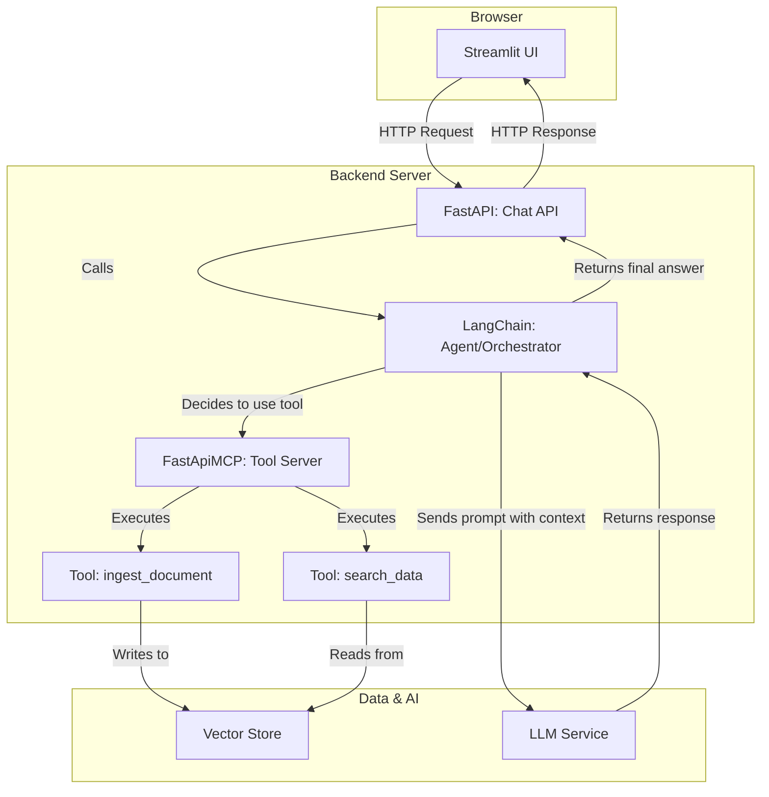

## 1\. 要件定義書

### 1.1. プロジェクト概要

  * **プロジェクト名**: インテリジェントRAGチャットシステム
  * **目的**: 社内に散在するドキュメント（規定、議事録、マニュアル等）をLLMに連携させ、従業員が自然言語で質問することで、迅速かつ正確に必要な情報を得られるようにする。これにより、情報検索の時間を削減し、業務効率を向上させる。

### 1.2. ユーザーストーリー

  * **システム管理者として**:
      * システムで検索対象としたいドキュメント（PDF, Markdown）をアップロード（Ingest）したい。
  * **一般従業員として**:
      * チャットUIを通じて、業務に関する質問を自然言語で入力したい。
      * システムが関連ドキュメントを検索し、その内容に基づいて生成された回答を受け取りたい。
      * 回答の根拠となったドキュメント名や箇所を確認したい。
      * 過去の質問と回答の履歴を自分のセッション内で確認したい。

### 1.3. 機能要件

| ID | 機能名 | 概要 |
| :-- | :--- | :--- |
| FR-01 | **チャットインターフェース** | ユーザーが質問を入力し、システムからの応答を表示するUIを提供する。 |
| FR-02 | **LLM応答生成** | ユーザーの質問に対し、LLMを用いて自然な回答を生成する。 |
| FR-03 | **ドキュメント取込 (Ingest)** | 管理者が指定したドキュメントを読み込み、検索可能な状態（Vector Store）にするためのMCPツール。 |
| FR-04 | **ドキュメント検索 (Search)** | ユーザーの質問に関連するドキュメントをVector Storeから検索し、LLMのコンテキストとして利用するためのMCPツール。 |
| FR-05 | **引用表示** | 生成された回答の根拠となったドキュメントの情報を表示する。 |
| FR-06 | **会話履歴管理** | ユーザーセッション中の会話履歴を保持し、表示する。 |

### 1.4. 非機能要件

| ID | 種別 | 概要 |
| :-- | :--- | :--- |
| NFR-01 | **パフォーマンス** | ユーザーの質問から95%が5秒以内に応答を返すこと。 |
| NFR-02 | **セキュリティ** | (将来) ユーザー認証を導入し、許可された従業員のみが利用できるようにする。 |
| NFR-03 | **可用性** | システムは業務時間中（平日9:00-18:00）に99.5%の稼働率を維持する。 |
| NFR-04 | **運用・保守性** | 主要な処理（APIリクエスト、ツール呼び出し、エラー）はログに出力する。 |
| NFR-05 | **拡張性** | LLMモデル（Ollama, Azure OpenAI等）を容易に切り替えられる構成にする。 |

-----

## 2\. 詳細な実装計画書

### 2.1. システムアーキテクチャ

  * **Frontend (Browser)**: StreamlitによるUI
  * **Backend (Server)**: FastAPI (API Gateway & LLM Orchestration), FastApiMCP (Tool Server)
  * **Data Store**: Vector Database (例: ChromaDB, FAISS) for RAG
  * **LLM Service**: Ollama (Local) / Azure OpenAI (Cloud)

<!-- end list -->



### 2.2. 技術スタック

| レイヤー | 技術 | 役割 |
| :--- | :--- | :--- |
| **Frontend** | Streamlit | 迅速なUIプロトタイピングと実装 |
| **Backend** | FastAPI | 非同期処理に対応した高速なAPIサーバー |
| | FastApiMCP | LLMから呼び出すためのツールを標準化されたAPIとして提供 |
| **LLM Orchestration**| LangChain | LLM、ツール、プロンプトを統合し、Agentを構築 |
| **LLM** | Ollama, Azure OpenAI API| 自然言語処理と応答生成 |
| **Vector Store**| ChromaDB (or FAISS) | ドキュメントのベクトル化と類似度検索 |
| **Container** | Docker, Docker Compose | 開発環境の再現性とデプロイの容易化 |
| **markitdown** | markdown | 各種ドキュメントをmarkdownへ変換 |

### 2.3. API設計 (主要エンドポイント)

**`POST /api/chat` (FastAPI)**

  * **役割**: ユーザーからのチャットメッセージを受け取り、LLMからの最終的な応答を返す。
  * **Request Body**:
    ```json
    {
      "message": "string",
      "session_id": "string", // 会話履歴の管理用
      "history": [ /* LangChain形式のMessage or Pydanticモデル */ ]
    }
    ```
  * **Response Body**:
    ```json
    {
      "answer": "string",
      "sources": [ // FR-05: 引用表示用
        {
          "document_name": "string",
          "snippet": "string"
        }
      ]
    }
    ```

**FastApiMCP Tools**

  * **`ingest_document(file_content: str, file_name: str)`**: ドキュメントを受け取り、チャンク分割、ベクトル化してVector Storeに保存する。
  * **`search_data(query: str)`**: クエリに関連するドキュメントチャンクをVector Storeから検索して返す。

### 2.4. データベース設計

  * **Vector Store (ChromaDB)**
      * **Collection**: `company_documents`
      * **Data**: ドキュメントの各チャンクのテキスト
      * **Metadata**: `{"source": "ファイル名", "page": ページ番号}` などを格納し、引用表示に利用。

### 2.5. 実装ステップ (WBS)

#### Phase 1: 基盤構築とツールサーバーの実装 (1-2週間)

1.  **環境構築**: Docker ComposeでFastAPI, Streamlit, ChromaDBが連携する開発環境を構築。
2.  **FastApiMCP実装**:
      * `ingest_document` ツールを実装。まずはテキストファイルを受け取れるようにする。
      * `search_data` ツールを実装。ChromaDBから検索できるようにする。
3.  **単体テスト**: 各ツールが正しく動作することをテストする。

#### Phase 2: LLM連携とチャットAPIの実装 (1-2週間)

1.  **MCPクライアント実装**: LangChainの`Tool`クラスを継承し、FastApiMCPサーバーを呼び出すクライアントを実装。
2.  **LangChain Agent構築**:
      * `search_data`ツールをAgentに登録。
      * システムプロンプトを設計し、「あなたは社内ドキュメントに詳しいアシスタントです...」といった役割を与える。
3.  **FastAPI `/chat` エンドポイント実装**:
      * リクエストを受け取り、LangChain Agentを呼び出して応答を生成するロジックを実装。
      * この時点では、`curl`などで動作確認。

#### Phase 3: フロントエンドの実装 (1週間)

1.  **Streamlit UI作成**:
      * チャット履歴表示エリアと入力フォームを実装。
      * `st.session_state`でセッション内の会話履歴を管理。
2.  **API連携**:
      * ユーザー入力時にFastAPIの`/chat`エンドポイントを呼び出す。
      * 応答（回答と引用元）をパースして画面に整形して表示する。

#### Phase 4: 改善と拡張 (継続)

1.  **ドキュメントローダー拡張**: PDFなど、対応するドキュメント形式を増やす。
2.  **ストリーミング応答**: `StreamingResponse`を使い、LLMの生成過程をリアルタイムでUIに表示する。
3.  **認証導入**: FastAPIにOAuth2などの認証ミドルウェアを導入する。
4.  **LangGraphへの移行検討**: ツール呼び出しが複数回に及ぶ、あるいはユーザーの意図に応じてフローを分岐させるなど、より複雑な制御が必要になった場合に移行を検討する。
